===================
Matplotlib tutorial
===================

------------------
Nicolas P. Rougier
------------------

.. image:: https://zenodo.org/badge/doi/10.5281/zenodo.28747.svg
   :target: http://dx.doi.org/10.5281/zenodo.28747

.. contents:: Table of Contents
   :local:
   :depth: 1

Sources are available from
`github <https://github.com/rougier/matplotlib-tutorial>`_

All code and material is licensed under a `Creative Commons
Attribution-ShareAlike 4.0
<http://creativecommons.org/licenses/by-sa/4.0>`_.

You can test your installation before the tutorial using the `check-installation.py <scripts/check-installation.py>`_ script.

See also:

* `From Python to Numpy <http://www.labri.fr/perso/nrougier/from-python-to-numpy/>`_
* `100 Numpy exercices <https://github.com/rougier/numpy-100>`_
* `Ten simple rules for better figures <http://journals.plos.org/ploscompbiol/article?id=10.1371/journal.pcbi.1003833>`_

Introduction
============

matplotlib is probably the single most used Python package for 2D-graphics. It
provides both a very quick way to visualize data from Python and
publication-quality figures in many formats.  We are going to explore
matplotlib in interactive mode covering most common cases.

IPython and the pylab mode
--------------------------

`IPython <http://ipython.org/>`_ is an enhanced interactive Python shell that
has lots of interesting features including named inputs and outputs, access to
shell commands, improved debugging and much more. When we start it with the
command line argument -pylab (--pylab since IPython version 0.12), it allows
interactive matplotlib sessions that have Matlab/Mathematica-like functionality.

pyplot
------

pyplot provides a convenient interface to the matplotlib object-oriented
plotting library. It is modeled closely after Matlab(TM). Therefore, the
majority of plotting commands in pyplot have Matlab(TM) analogs with similar
arguments. Important commands are explained with interactive examples.

Simple plot
===========

In this section, we want to draw the cosine and sine functions on the same
plot. Starting from the default settings, we'll enrich the figure step by step
to make it nicer.

The first step is to get the data for the sine and cosine functions:

::

   import numpy as np

   X = np.linspace(-np.pi, np.pi, 256, endpoint=True)
   C, S = np.cos(X), np.sin(X)

X is now a NumPy array with 256 values ranging from -π to +π (included). C is
the cosine (256 values) and S is the sine (256 values).

To run the example, you can download each of the examples and run it using::

    $ python exercice_1.py

You can get source for each step by clicking on the corresponding figure.

Using defaults
--------------

.. admonition:: Documentation

   * `plot tutorial <http://matplotlib.sourceforge.net/users/pyplot_tutorial.html>`_
   * `plot() command <http://matplotlib.sourceforge.net/api/pyplot_api.html#matplotlib.pyplot.plot>`_

.. image:: figures/exercice_1.png
   :align: right
   :target: scripts/exercice_1.py

Matplotlib comes with a set of default settings that allow customizing all
kinds of properties. You can control the defaults of almost every property in
matplotlib: figure size and dpi, line width, color and style, axes, axis and
grid properties, text and font properties and so on. While matplotlib defaults
are rather good in most cases, you may want to modify some properties for
specific cases.

.. include:: scripts/exercice_1.py
   :code: python
   :start-line: 4

Instantiating defaults
----------------------

.. admonition:: Documentation

   *  `Customizing matplotlib <http://matplotlib.sourceforge.net/users/customizing.html>`_

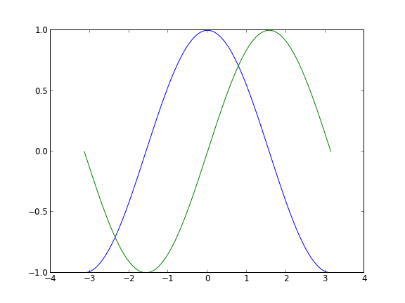

In the script below, we've instantiated (and commented) all the figure settings
that influence the appearance of the plot. The settings have been explicitly
set to their default values, but now you can interactively play with the values
to explore their affect (see `Line properties`_ and `Line styles`_ below).

.. include:: scripts/exercice_2.py
   :code: python
   :start-line: 4
             

Changing colors and line widths
--------------------------------

.. admonition:: Documentation

   * `Controlling line properties <http://matplotlib.sourceforge.net/users/pyplot_tutorial.html#controlling-line-properties>`_
   * `Line API <http://matplotlib.sourceforge.net/api/artist_api.html#matplotlib.lines.Line2D>`_

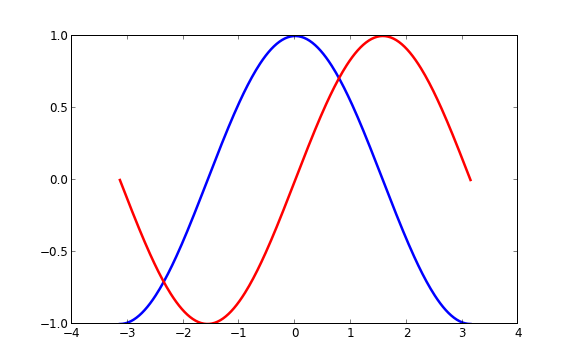

As a first step, we want to have the cosine in blue and the sine in red and a
slightly thicker line for both of them. We'll also slightly alter the figure
size to make it more horizontal.

::

   ...
   plt.figure(figsize=(10,6), dpi=80)
   plt.plot(X, C, color="blue", linewidth=2.5, linestyle="-")
   plt.plot(X, S, color="red",  linewidth=2.5, linestyle="-")
   ...

Setting limits
--------------

.. admonition:: Documentation

   * `xlim() command <http://matplotlib.sourceforge.net/api/pyplot_api.html#matplotlib.pyplot.xlim>`_
   * `ylim() command <http://matplotlib.sourceforge.net/api/pyplot_api.html#matplotlib.pyplot.ylim>`_

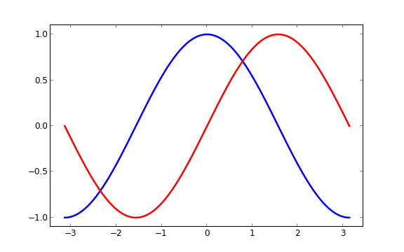

Current limits of the figure are a bit too tight and we want to make some space
in order to clearly see all data points.

::

   ...
   plt.xlim(X.min()*1.1, X.max()*1.1)
   plt.ylim(C.min()*1.1, C.max()*1.1)
   ...

Setting ticks
-------------

.. admonition:: Documentation

   * `xticks() command <http://matplotlib.sourceforge.net/api/pyplot_api.html#matplotlib.pyplot.xticks>`_
   * `yticks() command <http://matplotlib.sourceforge.net/api/pyplot_api.html#matplotlib.pyplot.yticks>`_
   * `Tick container <http://matplotlib.sourceforge.net/users/artists.html#axis-container>`_
   * `Tick locating and formatting <http://matplotlib.sourceforge.net/api/ticker_api.html>`_

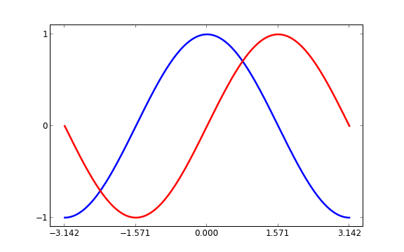

Current ticks are not ideal because they do not show the interesting values
(+/-π,+/-π/2) for sine and cosine. We'll change them such that they show only
these values.

::

   ...
   plt.xticks( [-np.pi, -np.pi/2, 0, np.pi/2, np.pi])
   plt.yticks([-1, 0, +1])
   ...

Setting tick labels
-------------------

.. admonition:: Documentation

   * `Working with text <http://matplotlib.sourceforge.net/users/index_text.html>`_
   * `xticks() command <http://matplotlib.sourceforge.net/api/pyplot_api.html#matplotlib.pyplot.xticks>`_
   * `yticks() command <http://matplotlib.sourceforge.net/api/pyplot_api.html#matplotlib.pyplot.yticks>`_
   * `set_xticklabels() <http://matplotlib.sourceforge.net/api/axes_api.html?#matplotlib.axes.Axes.set_xticklabels>`_
   * `set_yticklabels() <http://matplotlib.sourceforge.net/api/axes_api.html?#matplotlib.axes.Axes.set_yticklabels>`_

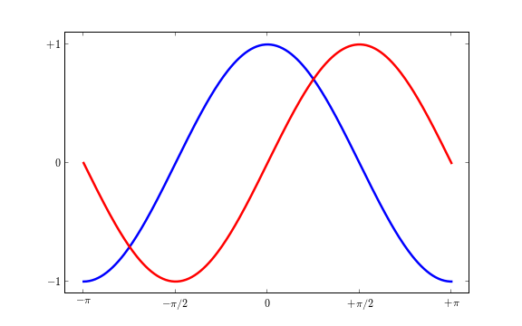

Ticks are now properly placed but their label is not very explicit. We could
guess that 3.142 is π but it would be better to make it explicit. When we set
tick values, we can also provide a corresponding label in the second argument
list. Note that we'll use latex to allow for nice rendering of the label.

::

   ...
   plt.xticks([-np.pi, -np.pi/2, 0, np.pi/2, np.pi],
          [r'$-\pi$', r'$-\pi/2$', r'$0$', r'$+\pi/2$', r'$+\pi$'])

   plt.yticks([-1, 0, +1],
          [r'$-1$', r'$0$', r'$+1$'])
   ...

Moving spines
-------------

.. admonition:: Documentation

   * `Spines <http://matplotlib.sourceforge.net/api/spines_api.html#matplotlib.spines>`_
   * `Axis container <http://matplotlib.sourceforge.net/users/artists.html#axis-container>`_
   * `Transformations tutorial <http://matplotlib.sourceforge.net/users/transforms_tutorial.html>`_

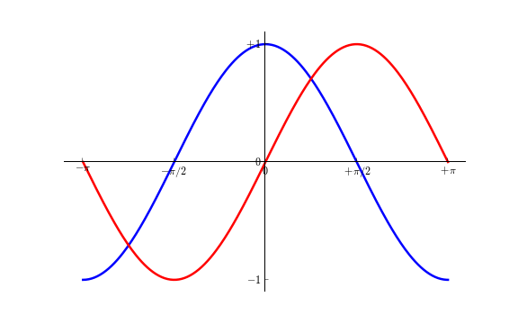

Spines are the lines connecting the axis tick marks and noting the boundaries
of the data area. They can be placed at arbitrary positions and until now, they
were on the border of the axis. We'll change that since we want to have them in
the middle. Since there are four of them (top/bottom/left/right), we'll discard
the top and right by setting their color to none and we'll move the bottom and
left ones to coordinate 0 in data space coordinates.

::

   ...
   ax = plt.gca()
   ax.spines['right'].set_color('none')
   ax.spines['top'].set_color('none')
   ax.xaxis.set_ticks_position('bottom')
   ax.spines['bottom'].set_position(('data',0))
   ax.yaxis.set_ticks_position('left')
   ax.spines['left'].set_position(('data',0))
   ...

Adding a legend
---------------

.. admonition:: Documentation

   * `Legend guide <http://matplotlib.sourceforge.net/users/legend_guide.html>`_
   * `legend() command <http://matplotlib.sourceforge.net/api/pyplot_api.html#matplotlib.pyplot.legend>`_
   * `Legend API <http://matplotlib.sourceforge.net/api/legend_api.html#matplotlib.legend.Legend>`_

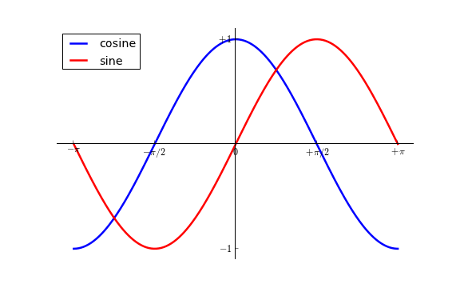

Let's add a legend in the upper left corner. This only requires adding the
keyword argument label (that will be used in the legend box) to the plot
commands.

::

   ...
   plt.plot(X, C, color="blue", linewidth=2.5, linestyle="-", label="cosine")
   plt.plot(X, S, color="red",  linewidth=2.5, linestyle="-", label="sine")

   plt.legend(loc='upper left', frameon=False)
   ...

Annotate some points
--------------------

.. admonition:: Documentation

   * `Annotating axis <http://matplotlib.sourceforge.net/users/annotations_guide.html>`_
   * `annotate() command <http://matplotlib.sourceforge.net/api/pyplot_api.html#matplotlib.pyplot.annotate>`_

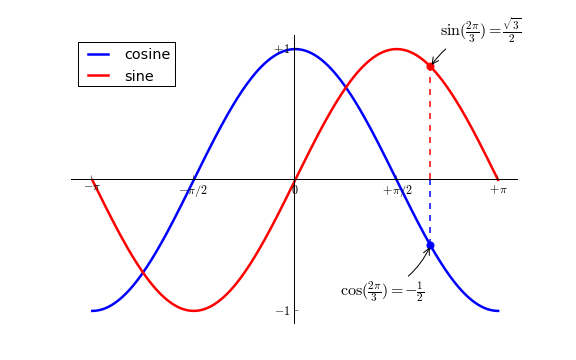

Let's annotate some interesting points using the annotate command. We choose the
2π/3 value and we want to annotate both the sine and the cosine. We'll first
draw a marker on the curve as well as a straight dotted line. Then, we'll use
the annotate command to display some text with an arrow.

::

   ...

   t = 2*np.pi/3
   plt.plot([t,t],[0,np.cos(t)], color ='blue', linewidth=1.5, linestyle="--")
   plt.scatter([t,],[np.cos(t),], 50, color ='blue')

   plt.annotate(r'$\sin(\frac{2\pi}{3})=\frac{\sqrt{3}}{2}$',
                xy=(t, np.sin(t)), xycoords='data',
                xytext=(+10, +30), textcoords='offset points', fontsize=16,
                arrowprops=dict(arrowstyle="->", connectionstyle="arc3,rad=.2"))

   plt.plot([t,t],[0,np.sin(t)], color ='red', linewidth=1.5, linestyle="--")
   plt.scatter([t,],[np.sin(t),], 50, color ='red')

   plt.annotate(r'$\cos(\frac{2\pi}{3})=-\frac{1}{2}$',
                xy=(t, np.cos(t)), xycoords='data',
                xytext=(-90, -50), textcoords='offset points', fontsize=16,
                arrowprops=dict(arrowstyle="->", connectionstyle="arc3,rad=.2"))
   ...

Devil is in the details
------------------------

.. admonition:: Documentation

   * `Artists <http://matplotlib.sourceforge.net/api/artist_api.html>`_
   * `BBox <http://matplotlib.sourceforge.net/api/artist_api.html#matplotlib.text.Text.set_bbox>`_

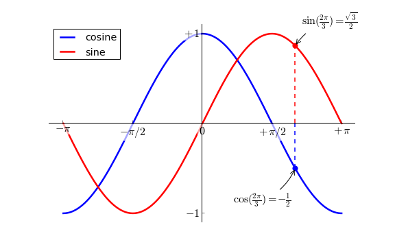

The tick labels are now hardly visible because of the blue and red lines. We can
make them bigger and we can also adjust their properties such that they'll be
rendered on a semi-transparent white background. This will allow us to see both
the data and the labels.

::

   ...
   for label in ax.get_xticklabels() + ax.get_yticklabels():
       label.set_fontsize(16)
       label.set_bbox(dict(facecolor='white', edgecolor='None', alpha=0.65 ))
   ...

Figures, Subplots, Axes and Ticks
=================================

So far we have used implicit figure and axes creation. This is handy for fast
plots. We can have more control over the display using figure, subplot, and
axes explicitly. A figure in matplotlib means the whole window in the user
interface. Within this figure there can be subplots. While subplot positions
the plots in a regular grid, axes allows free placement within the figure. Both
can be useful depending on your intention. We've already worked with figures
and subplots without explicitly calling them. When we call plot, matplotlib
calls gca() to get the current axes and gca in turn calls gcf() to get the
current figure. If there is none it calls figure() to make one, strictly
speaking, to make a subplot(111). Let's look at the details.

Figures
-------

A figure is the windows in the GUI that has "Figure #" as title. Figures
are numbered starting from 1 as opposed to the normal Python way starting
from 0. This is clearly MATLAB-style.  There are several parameters that
determine what the figure looks like:

==============  ======================= ============================================
Argument        Default                 Description
==============  ======================= ============================================
num             1                       number of figure
figsize         figure.figsize          figure size in in inches (width, height)
dpi             figure.dpi              resolution in dots per inch
facecolor       figure.facecolor        color of the drawing background
edgecolor       figure.edgecolor        color of edge around the drawing background
frameon         True                    draw figure frame or not
==============  ======================= ============================================

The defaults can be specified in the resource file and will be used most of the
time. Only the number of the figure is frequently changed.

When you work with the GUI you can close a figure by clicking on the x in the
upper right corner. You can also close a figure programmatically by calling
close. Depending on the argument it closes (1) the current figure (no
argument), (2) a specific figure (figure number or figure instance as
argument), or (3) all figures (all as argument).

As with other objects, you can set figure properties with the set_something methods.

Subplots
--------

With subplot you can arrange plots in a regular grid. You need to specify the
number of rows and columns and the number of the plot. Note that the `gridspec
<http://matplotlib.sourceforge.net/users/gridspec.html>`_ command is a more
powerful alternative.

.. image:: figures/subplot-horizontal.png
   :target: scripts/subplot-horizontal.py
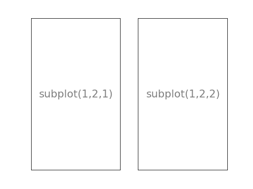
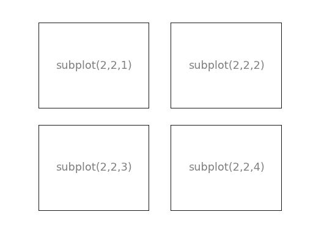
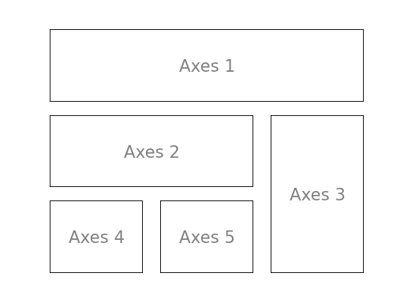

Axes
----

Axes are very similar to subplots but allow placement of plots at any location
in the figure. So if we want to put a smaller plot inside a bigger one we do
so with axes.

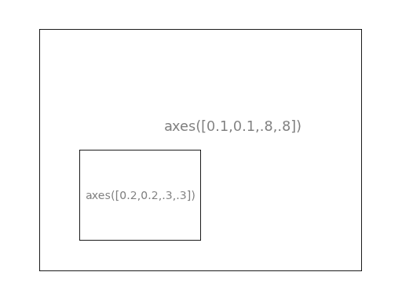
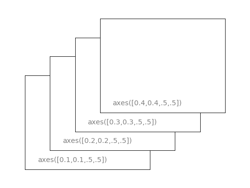

Ticks
-----

Well formatted ticks are an important part of publishing-ready
figures. Matplotlib provides a totally configurable system for ticks. There are
tick locators to specify where ticks should appear and tick formatters to give
ticks the appearance you want. Major and minor ticks can be located and
formatted independently from each other. By default minor ticks are not shown,
i.e. there is only an empty list for them because it is as NullLocator (see
below).

Tick Locators
.............

There are several locators for different kind of requirements:

.. list-table::
   :widths: 20 70
   :header-rows: 1

   * - Class
     - Description

   * - ``NullLocator``
     - No ticks.

       .. image:: figures/ticks-NullLocator.png
     
   * - ``IndexLocator``
     - Place a tick on every multiple of some base number of points plotted.

       .. image:: figures/ticks-IndexLocator.png

   * - ``FixedLocator``
     - Tick locations are fixed.

       .. image:: figures/ticks-FixedLocator.png

   * - ``LinearLocator``
     - Determine the tick locations.

       .. image:: figures/ticks-LinearLocator.png

   * - ``MultipleLocator``
     - Set a tick on every integer that is multiple of some base.

       .. image:: figures/ticks-MultipleLocator.png

   * - ``AutoLocator``
     - Select no more than n intervals at nice locations.

       .. image:: figures/ticks-AutoLocator.png

   * - ``LogLocator``
     - Determine the tick locations for log axes.

       .. image:: figures/ticks-LogLocator.png

All of these locators derive from the base class matplotlib.ticker.Locator.
You can make your own locator deriving from it. Handling dates as ticks can be
especially tricky. Therefore, matplotlib provides special locators in
matplotlib.dates.

Animation
=========

For quite a long time, animation in matplotlib was not an easy task and was
done mainly through clever hacks. However, things have started to change since
version 1.1 and the introduction of tools for creating animation very
intuitively, with the possibility to save them in all kind of formats (but don't
expect to be able to run very complex animations at 60 fps though).

.. admonition:: Documentation

   *  See `Animation <http://matplotlib.org/api/animation_api.html>`_

The most easy way to make an animation in matplotlib is to declare a
FuncAnimation object that specifies to matplotlib what is the figure to
update, what is the update function and what is the delay between frames.

Drip drop
---------

A very simple rain effect can be obtained by having small growing rings
randomly positioned over a figure. Of course, they won't grow forever since the
wave is supposed to damp with time. To simulate that, we can use a more and
more transparent color as the ring is growing, up to the point where it is no
more visible. At this point, we remove the ring and create a new one.

First step is to create a blank figure:

.. code:: python

   # New figure with white background
   fig = plt.figure(figsize=(6,6), facecolor='white')

   # New axis over the whole figure, no frame and a 1:1 aspect ratio
   ax = fig.add_axes([0,0,1,1], frameon=False, aspect=1)

   
Next, we need to create several rings. For this, we can use the scatter plot
object that is generally used to visualize points cloud, but we can also use it
to draw rings by specifying we don't have a facecolor. We also have to take
care of initial size and color for each ring such that we have all sizes between
a minimum and a maximum size. In addition, we need to make sure the largest ring 
is almost transparent.

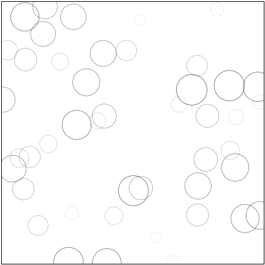

.. code:: python

   # Number of ring
   n = 50
   size_min = 50
   size_max = 50*50
          
   # Ring position 
   P = np.random.uniform(0,1,(n,2))

   # Ring colors
   C = np.ones((n,4)) * (0,0,0,1)
   # Alpha color channel goes from 0 (transparent) to 1 (opaque)
   C[:,3] = np.linspace(0,1,n)

   # Ring sizes
   S = np.linspace(size_min, size_max, n)

   # Scatter plot
   scat = ax.scatter(P[:,0], P[:,1], s=S, lw = 0.5,
                     edgecolors = C, facecolors='None')

   # Ensure limits are [0,1] and remove ticks
   ax.set_xlim(0,1), ax.set_xticks([])
   ax.set_ylim(0,1), ax.set_yticks([])

Now, we need to write the update function for our animation. We know that at
each time step each ring should grow and become more transparent while the 
largest ring should be totally transparent and thus removed. Of course, we won't 
actually remove the largest ring but re-use it to set a new ring at a new random
position, with nominal size and color. Hence, we keep the number of rings
constant.

  
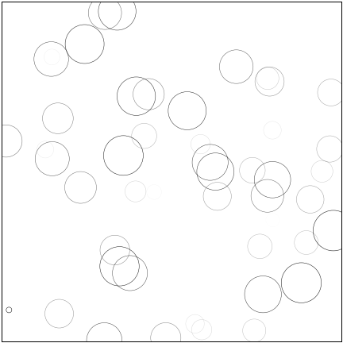

.. code:: python

   def update(frame):
       global P, C, S

       # Every ring is made more transparent
       C[:,3] = np.maximum(0, C[:,3] - 1.0/n)

       # Each ring is made larger
       S += (size_max - size_min) / n

       # Reset ring specific ring (relative to frame number)
       i = frame % 50
       P[i] = np.random.uniform(0,1,2)
       S[i] = size_min
       C[i,3] = 1

       # Update scatter object
       scat.set_edgecolors(C)
       scat.set_sizes(S)
       scat.set_offsets(P)

       # Return the modified object
       return scat,

Last step is to tell matplotlib to use this function as an update function for
the animation and display the result or save it as a movie:

.. code:: python

   animation = FuncAnimation(fig, update, interval=10, blit=True, frames=200)
   # animation.save('rain.gif', writer='imagemagick', fps=30, dpi=40)
   plt.show()

   
   
Earthquakes
-----------

We'll now use the rain animation to visualize earthquakes on the planet from
the last 30 days. The USGS Earthquake Hazards Program is part of the National
Earthquake Hazards Reduction Program (NEHRP) and provides several data on their
`website <http://earthquake.usgs.gov>`_. Those data are sorted according to
earthquakes magnitude, ranging from significant only down to all earthquakes,
major or minor. You would be surprised by the number of minor earthquakes
happening every hour on the planet. Since this would represent too much data
for us, we'll stick to earthquakes with magnitude > 4.5. At the time of writing,
this already represent more than 300 earthquakes in the last 30 days.

First step is to read and convert data. We'll use the `urllib` library that
allows us to open and read remote data. Data on the website use the `CSV` format
whose content is given by the first line::

  time,latitude,longitude,depth,mag,magType,nst,gap,dmin,rms,net,id,updated,place,type
  2015-08-17T13:49:17.320Z,37.8365,-122.2321667,4.82,4.01,mw,...
  2015-08-15T07:47:06.640Z,-10.9045,163.8766,6.35,6.6,mwp,...

We are only interested in latitude, longitude and magnitude and we won't parse
time of event (ok, that's bad, feel free to send me a PR).
  

.. code:: python

   import urllib
   from mpl_toolkits.basemap import Basemap

   # -> http://earthquake.usgs.gov/earthquakes/feed/v1.0/csv.php
   feed = "http://earthquake.usgs.gov/earthquakes/feed/v1.0/summary/"

   # Significant earthquakes in the last 30 days
   # url = urllib.request.urlopen(feed + "significant_month.csv")

   # Magnitude > 4.5
   url = urllib.request.urlopen(feed + "4.5_month.csv")

   # Magnitude > 2.5
   # url = urllib.request.urlopen(feed + "2.5_month.csv")

   # Magnitude > 1.0
   # url = urllib.request.urlopen(feed + "1.0_month.csv")

   # Reading and storage of data
   data = url.read()
   data = data.split(b'\n')[+1:-1]
   E = np.zeros(len(data), dtype=[('position',  float, 2),
                                  ('magnitude', float, 1)])

   for i in range(len(data)):
       row = data[i].split(',')
       E['position'][i] = float(row[2]),float(row[1])
       E['magnitude'][i] = float(row[4])

Now, we need to draw the earth on a figure to show precisely where the earthquake
center is and to translate latitude/longitude in some coordinates matplotlib
can handle. Fortunately, there is the `basemap
<http://matplotlib.org/basemap/>`_ project (that tends to be replaced by the
more complete `cartopy <http://scitools.org.uk/cartopy/>`_) that is really
simple to install and to use. First step is to define a projection to draw the
earth onto a screen (there exists many different projections) and we'll stick
to the `mill` projection which is rather standard for non-specialist like me.
       

.. code:: python

   fig = plt.figure(figsize=(14,10))
   ax = plt.subplot(1,1,1)

   earth = Basemap(projection='mill')

Next, we request to draw coastline and fill continents:

.. code:: python
          
   earth.drawcoastlines(color='0.50', linewidth=0.25)
   earth.fillcontinents(color='0.95')

The `earth` object will also be used to translate coordinates quite
automatically. We are almost finished. Last step is to adapt the rain code and
put some eye candy:

.. code:: python

   P = np.zeros(50, dtype=[('position', float, 2),
                            ('size',     float, 1),
                            ('growth',   float, 1),
                            ('color',    float, 4)])
   scat = ax.scatter(P['position'][:,0], P['position'][:,1], P['size'], lw=0.5,
                     edgecolors = P['color'], facecolors='None', zorder=10)

   def update(frame):
       current = frame % len(E)
       i = frame % len(P)

       P['color'][:,3] = np.maximum(0, P['color'][:,3] - 1.0/len(P))
       P['size'] += P['growth']

       magnitude = E['magnitude'][current]
       P['position'][i] = earth(*E['position'][current])
       P['size'][i] = 5
       P['growth'][i]= np.exp(magnitude) * 0.1

       if magnitude < 6:
           P['color'][i]    = 0,0,1,1
       else:
           P['color'][i]    = 1,0,0,1
       scat.set_edgecolors(P['color'])
       scat.set_facecolors(P['color']*(1,1,1,0.25))
       scat.set_sizes(P['size'])
       scat.set_offsets(P['position'])
       return scat,

       
   animation = FuncAnimation(fig, update, interval=10)
   plt.show()

If everything went well, you should obtain something like this (with animation):

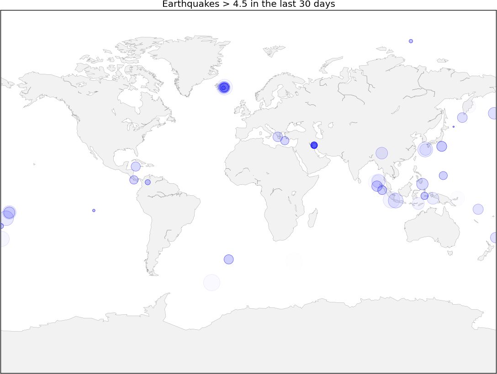

   
Other Types of Plots
====================

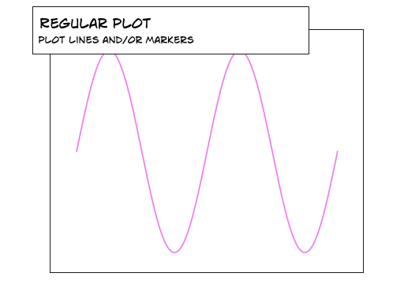

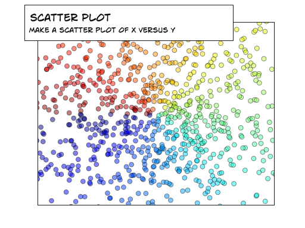

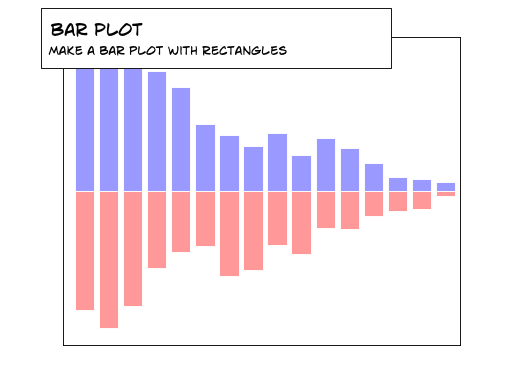

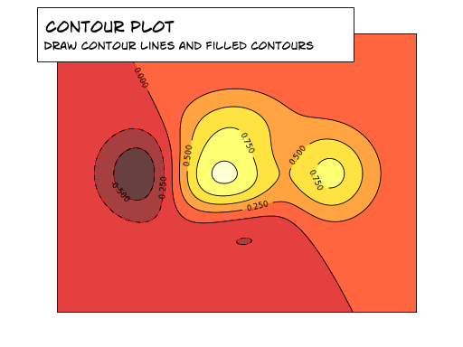

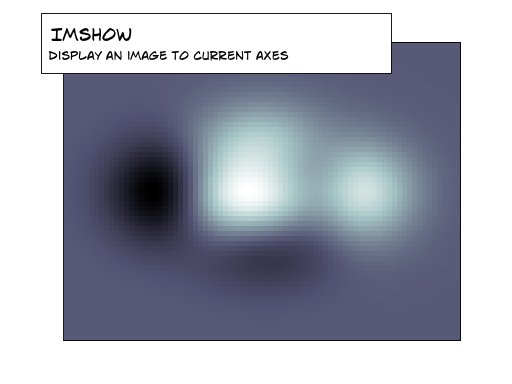

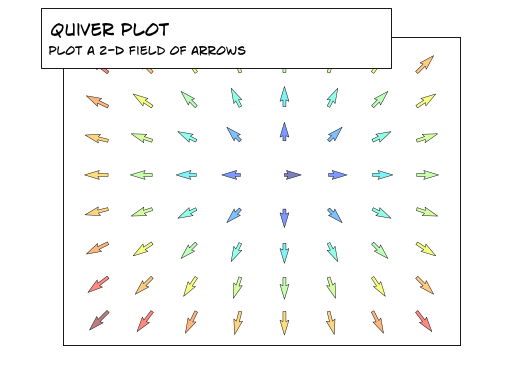

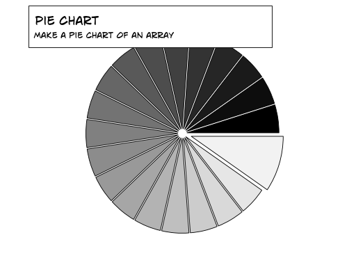

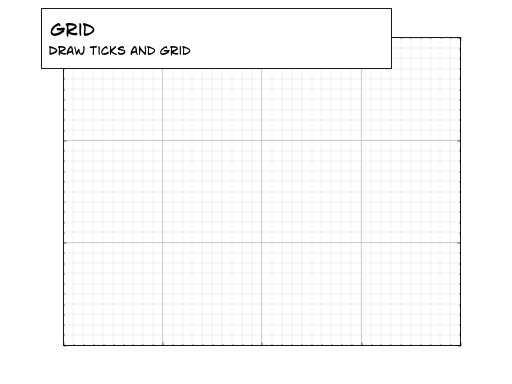

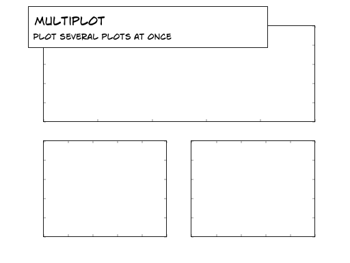

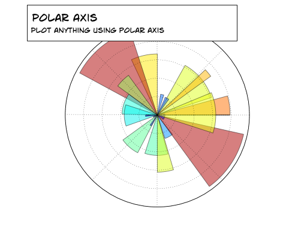

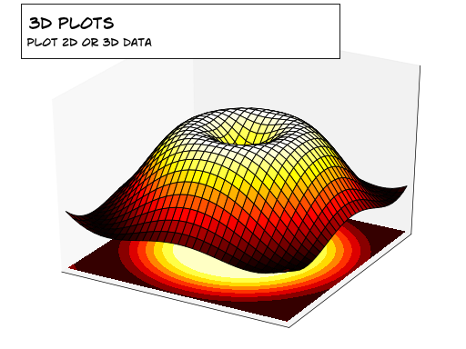

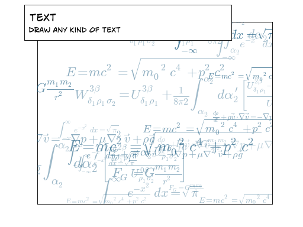

Regular Plots
-------------

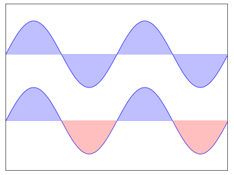

.. admonition:: Hints

   You need to use the `fill_between
   <http://matplotlib.sourceforge.net/api/pyplot_api.html#matplotlib.pyplot.fill_between>`_
   command.

Starting from the code below, try to reproduce the graphic on the right taking
care of filled areas.

::

   import numpy as np
   import matplotlib.pyplot as plt

   n = 256
   X = np.linspace(-np.pi,np.pi,n,endpoint=True)
   Y = np.sin(2*X)

   plt.plot (X, Y+1, color='blue', alpha=1.00)
   plt.plot (X, Y-1, color='blue', alpha=1.00)
   plt.show()

Click on figure for solution.

Scatter Plots
-------------

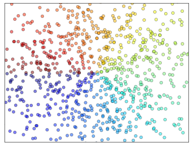

.. admonition:: Hints

   Color is given by angle of (X,Y).

Starting from the code below, try to reproduce the graphic on the right taking
care of marker size, color and transparency.

::

   import numpy as np
   import matplotlib.pyplot as plt

   n = 1024
   X = np.random.normal(0,1,n)
   Y = np.random.normal(0,1,n)

   plt.scatter(X,Y)
   plt.show()

Click on figure for solution.

Bar Plots
---------

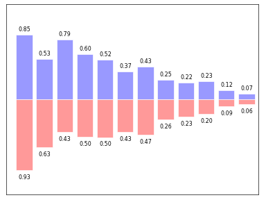

.. admonition:: Hints

   You need to take care of text alignment.

Starting from the code below, try to reproduce the graphic on the right by
adding labels for red bars.

::

   import numpy as np
   import matplotlib.pyplot as plt

   n = 12
   X = np.arange(n)
   Y1 = (1-X/float(n)) * np.random.uniform(0.5,1.0,n)
   Y2 = (1-X/float(n)) * np.random.uniform(0.5,1.0,n)

   plt.bar(X, +Y1, facecolor='#9999ff', edgecolor='white')
   plt.bar(X, -Y2, facecolor='#ff9999', edgecolor='white')

   for x,y in zip(X,Y1):
       plt.text(x+0.4, y+0.05, '%.2f' % y, ha='center', va= 'bottom')

   plt.ylim(-1.25,+1.25)
   plt.show()

Click on figure for solution.

Contour Plots
-------------

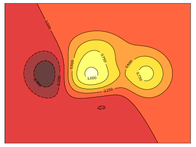

.. admonition:: Hints

   You need to use the `clabel
   <http://matplotlib.sourceforge.net/api/pyplot_api.html#matplotlib.pyplot.clabel>`_
   command.

Starting from the code below, try to reproduce the graphic on the right taking
care of the colormap (see `Colormaps`_ below). 

::

   import numpy as np
   import matplotlib.pyplot as plt

   def f(x,y): return (1-x/2+x**5+y**3)*np.exp(-x**2-y**2)

   n = 256
   x = np.linspace(-3,3,n)
   y = np.linspace(-3,3,n)
   X,Y = np.meshgrid(x,y)

   plt.contourf(X, Y, f(X,Y), 8, alpha=.75, cmap='jet')
   C = plt.contour(X, Y, f(X,Y), 8, colors='black', linewidth=.5)
   plt.show()

Click on figure for solution.

Imshow
------

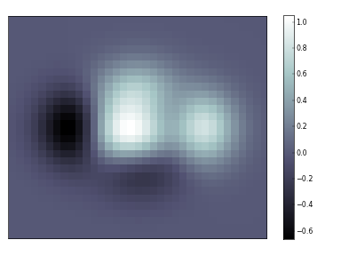

.. admonition:: Hints

   You need to take care of the ``origin`` of the image in the imshow command and
   use a `colorbar
   <http://matplotlib.sourceforge.net/api/pyplot_api.html#matplotlib.pyplot.colorbar>`_.

Starting from the code below, try to reproduce the graphic on the right taking
care of colormap, image interpolation and origin.

::

   import numpy as np
   import matplotlib.pyplot as plt

   def f(x,y): return (1-x/2+x**5+y**3)*np.exp(-x**2-y**2)

   n = 10
   x = np.linspace(-3,3,4*n)
   y = np.linspace(-3,3,3*n)
   X,Y = np.meshgrid(x,y)
   plt.imshow(f(X,Y))
   plt.show()

Click on figure for solution.

Pie Charts
----------

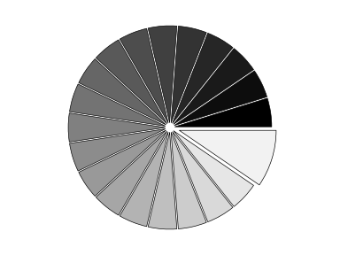

.. admonition:: Hints

   You need to modify Z.

Starting from the code below, try to reproduce the graphic on the right taking
care of colors and slices size.

::

   import numpy as np
   import matplotlib.pyplot as plt

   n = 20
   Z = np.random.uniform(0,1,n)
   plt.pie(Z)
   plt.show()

Click on figure for solution.

Quiver Plots
------------

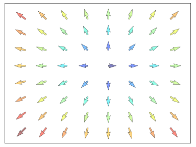

.. admonition:: Hints

   You need to draw arrows twice.

Starting from the code above, try to reproduce the graphic on the right taking
care of colors and orientations.

::

   import numpy as np
   import matplotlib.pyplot as plt

   n = 8
   X,Y = np.mgrid[0:n,0:n]
   plt.quiver(X,Y)
   plt.show()

Click on figure for solution.

Grids
-----

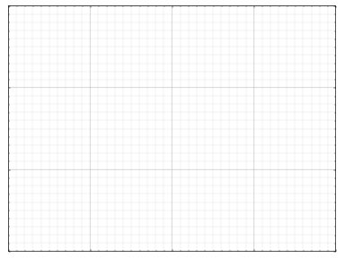

Starting from the code below, try to reproduce the graphic on the right taking
care of line styles.

::

   import numpy as np
   import matplotlib.pyplot as plt

   axes = gca()
   axes.set_xlim(0,4)
   axes.set_ylim(0,3)
   axes.set_xticklabels([])
   axes.set_yticklabels([])

   plt.show()

Click on figure for solution.

Multi Plots
-----------

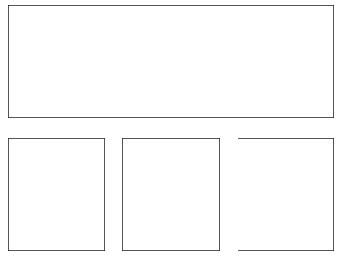

.. admonition:: Hints

   You can use several subplots with different partition.

Starting from the code below, try to reproduce the graphic on the right.

::

   import numpy as np
   import matplotlib.pyplot as plt

   plt.subplot(2,2,1)
   plt.subplot(2,2,3)
   plt.subplot(2,2,4)

   plt.show()

Click on figure for solution.

Polar Axis
----------

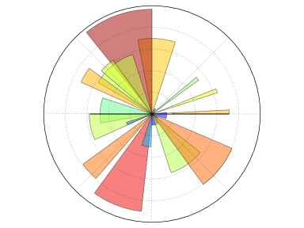

.. admonition:: Hints

   You only need to modify the ``axes`` line.

Starting from the code below, try to reproduce the graphic on the right.

::

   import numpy as np
   import matplotlib.pyplot as plt

   plt.axes([0,0,1,1])

   N = 20
   theta = np.arange(0.0, 2*np.pi, 2*np.pi/N)
   radii = 10*np.random.rand(N)
   width = np.pi/4*np.random.rand(N)
   bars = plt.bar(theta, radii, width=width, bottom=0.0)

   for r,bar in zip(radii, bars):
       bar.set_facecolor( cm.jet(r/10.))
       bar.set_alpha(0.5)

   plt.show()

Click on figure for solution.

3D Plots
--------

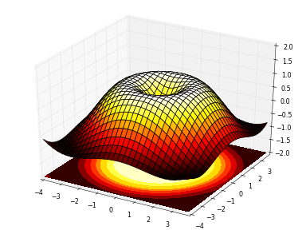

.. admonition:: Hints

   You need to use `contourf
   <http://matplotlib.sourceforge.net/api/pyplot_api.html#matplotlib.pyplot.contourf>`_.

Starting from the code below, try to reproduce the graphic on the right.

::

   import numpy as np
   import matplotlib.pyplot as plt
   from mpl_toolkits.mplot3d import Axes3D

   fig = plt.figure()
   ax = Axes3D(fig)
   X = np.arange(-4, 4, 0.25)
   Y = np.arange(-4, 4, 0.25)
   X, Y = np.meshgrid(X, Y)
   R = np.sqrt(X**2 + Y**2)
   Z = np.sin(R)

   ax.plot_surface(X, Y, Z, rstride=1, cstride=1, cmap='hot')

   plt.show()

Click on figure for solution.

Text
----

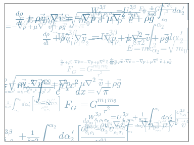

.. admonition:: Hints

   Have a look at the `matplotlib logo
   <http://matplotlib.sourceforge.net/examples/api/logo2.html>`_.

Try to do the same from scratch!

Click on figure for solution.

Beyond this tutorial
====================

Matplotlib benefits from extensive documentation as well as a large
community of users and developpers. Here are some links of interest:

Tutorials
---------

* `Pyplot tutorial <http://matplotlib.sourceforge.net/users/pyplot_tutorial.html>`_

  - Introduction
  - Controlling line properties
  - Working with multiple figures and axes
  - Working with text
  - 

* `Image tutorial <http://matplotlib.sourceforge.net/users/image_tutorial.html>`_

  - Startup commands
  - Importing image data into Numpy arrays
  - Plotting numpy arrays as images
  - 

* `Text tutorial <http://matplotlib.sourceforge.net/users/index_text.html>`_

  - Text introduction
  - Basic text commands
  - Text properties and layout
  - Writing mathematical expressions
  - Text rendering With LaTeX
  - Annotating text
  - 

* `Artist tutorial <http://matplotlib.sourceforge.net/users/artists.html>`_

  - Introduction
  - Customizing your objects
  - Object containers
  - Figure container
  - Axes container
  - Axis containers
  - Tick containers
  - 

* `Path tutorial <http://matplotlib.sourceforge.net/users/path_tutorial.html>`_

  - Introduction
  - Bézier example
  - Compound paths
  - 

* `Transforms tutorial <http://matplotlib.sourceforge.net/users/transforms_tutorial.html>`_

  - Introduction
  - Data coordinates
  - Axes coordinates
  - Blended transformations
  - Using offset transforms to create a shadow effect
  - The transformation pipeline
  - 

Matplotlib documentation
------------------------

* `User guide <http://matplotlib.sourceforge.net/users/index.html>`_

* `FAQ <http://matplotlib.sourceforge.net/faq/index.html>`_

  - Installation
  - Usage
  - How-To
  - Troubleshooting
  - Environment Variables
  - 

* `Screenshots <http://matplotlib.sourceforge.net/users/screenshots.html>`_

Code documentation
------------------

The code is fairly well documented and you can quickly access a specific
command from within a python session:

::

   >>> import matplotlib.pyplot as plt
   >>> help(plt)
   Help on function plot in module matplotlib.pyplot:

   plot(*args, **kwargs)
      Plot lines and/or markers to the
      :class:`~matplotlib.axes.Axes`.  *args* is a variable length
      argument, allowing for multiple *x*, *y* pairs with an
      optional format string.  For example, each of the following is
      legal::
    
          plot(x, y)         # plot x and y using default line style and color
          plot(x, y, 'bo')   # plot x and y using blue circle markers
          plot(y)            # plot y using x as index array 0..N-1
          plot(y, 'r+')      # ditto, but with red plusses
    
      If *x* and/or *y* is 2-dimensional, then the corresponding columns
      will be plotted.
      ...

Galleries
---------

The `matplotlib gallery <http://matplotlib.sourceforge.net/gallery.html>`_ is
also incredibly useful when you search how to render a given graphic. Each
example comes with its source.

A smaller gallery is also available `here <http://www.loria.fr/~rougier/coding/gallery/>`_.

Mailing lists
--------------

Finally, there is a `user mailing list
<https://mail.python.org/mailman/listinfo/matplotlib-users>`_ where you can
ask for help and a `developers mailing list
<https://mail.python.org/mailman/listinfo/matplotlib-devel>`_ that is more
technical.

Quick references
================

Here is a set of tables that show main properties and styles.

Line properties
----------------

.. list-table::
   :widths: 20 30 50
   :header-rows: 1

   * - Property
     - Description
     - Appearance

   * - alpha (or a)
     - alpha transparency on 0-1 scale
     - .. image:: figures/alpha.png

   * - antialiased
     - True or False - use antialised rendering
     - .. image:: figures/aliased.png
       .. image:: figures/antialiased.png

   * - color (or c)
     - matplotlib color arg
     - .. image:: figures/color.png

   * - linestyle (or ls)
     - see `Line properties`_
     -

   * - linewidth (or lw)
     - float, the line width in points
     - .. image:: figures/linewidth.png

   * - solid_capstyle
     - Cap style for solid lines
     - .. image:: figures/solid_capstyle.png

   * - solid_joinstyle
     - Join style for solid lines
     - .. image:: figures/solid_joinstyle.png

   * - dash_capstyle
     - Cap style for dashes
     - .. image:: figures/dash_capstyle.png

   * - dash_joinstyle
     - Join style for dashes
     - .. image:: figures/dash_joinstyle.png

   * - marker
     - see `Markers`_
     -

   * - markeredgewidth (mew)
     - line width around the marker symbol
     - .. image:: figures/mew.png

   * - markeredgecolor (mec)
     - edge color if a marker is used
     - .. image:: figures/mec.png

   * - markerfacecolor (mfc)
     - face color if a marker is used
     - .. image:: figures/mfc.png

   * - markersize (ms)
     - size of the marker in points
     - .. image:: figures/ms.png

Line styles
-----------

.. list-table::
   :widths: 15 30 50
   :header-rows: 1

   * - Symbol
     - Description
     - Appearance

   * - ``-``
     - solid line
     - .. image:: figures/linestyle--.png

   * - ``--``
     - dashed line
     - .. image:: figures/linestyle---.png

   * - ``-.``
     - dash-dot line
     - .. image:: figures/linestyle--dot.png

   * - ``:``
     - dotted line
     - .. image:: figures/linestyle-:.png

   * - ``.``
     - points
     - .. image:: figures/linestyle-dot.png

   * - ``,``
     - pixels
     - .. image:: figures/linestyle-,.png
     
   * - ``o``
     - circle
     - .. image:: figures/linestyle-o.png

   * - ``^``
     - triangle up
     - .. image:: figures/linestyle-^.png

   * - ``v``
     - triangle down
     - .. image:: figures/linestyle-v.png

   * - ``<``
     - triangle left
     - .. image:: figures/linestyle-<.png

   * - ``>``
     - triangle right
     - .. image:: figures/linestyle->.png

   * - ``s``
     - square
     - .. image:: figures/linestyle-s.png

   * - ``+``
     - plus
     - .. image:: figures/linestyle-+.png

   * - ``x``
     -  cross
     - .. image:: figures/linestyle-x.png

   * - ``D``
     - diamond
     - .. image:: figures/linestyle-dd.png

   * - ``d``
     - thin diamond
     - .. image:: figures/linestyle-d.png

   * - ``1``
     - tripod down
     - .. image:: figures/linestyle-1.png

   * - ``2``
     - tripod up
     - .. image:: figures/linestyle-2.png

   * - ``3``
     - tripod left
     - .. image:: figures/linestyle-3.png

   * - ``4``
     - tripod right
     - .. image:: figures/linestyle-4.png

   * - ``h``
     - hexagon
     - .. image:: figures/linestyle-h.png

   * - ``H``
     - rotated hexagon
     - .. image:: figures/linestyle-hh.png

   * - ``p``
     -  pentagon
     - .. image:: figures/linestyle-p.png

   * - ``|``
     - vertical line
     - .. image:: figures/linestyle-|.png

   * - ``_``
     - horizontal line
     - .. image:: figures/linestyle-_.png

Markers
-------

.. list-table::
   :widths: 15 30 50
   :header-rows: 1

   * - Symbol
     - Description
     - Appearance

   * - 0
     - tick left
     - .. image:: figures/marker-i0.png

   * - 1
     - tick right
     - .. image:: figures/marker-i1.png

   * - 2
     - tick up
     - .. image:: figures/marker-i2.png

   * - 3
     - tick down
     - .. image:: figures/marker-i3.png

   * - 4
     - caret left
     - .. image:: figures/marker-i4.png

   * - 5
     - caret right
     - .. image:: figures/marker-i5.png

   * - 6
     - caret up
     - .. image:: figures/marker-i6.png

   * - 7
     - caret down
     - .. image:: figures/marker-i7.png

   * - ``o``
     - circle
     - .. image:: figures/marker-o.png

   * - ``D``
     - diamond
     - .. image:: figures/marker-dd.png

   * - ``h``
     - hexagon 1
     - .. image:: figures/marker-h.png

   * - ``H``
     - hexagon 2
     - .. image:: figures/marker-hh.png

   * - ``_``
     - horizontal line
     - .. image:: figures/marker-_.png

   * - ``1``
     - tripod down
     - .. image:: figures/marker-1.png

   * - ``2``
     - tripod up
     - .. image:: figures/marker-2.png

   * - ``3``
     - tripod left
     - .. image:: figures/marker-3.png

   * - ``4``
     - tripod right
     - .. image:: figures/marker-4.png

   * - ``8``
     - octagon
     - .. image:: figures/marker-8.png

   * - ``p``
     - pentagon
     - .. image:: figures/marker-p.png

   * - ``^``
     - triangle up
     - .. image:: figures/marker-^.png

   * - ``v``
     - triangle down
     - .. image:: figures/marker-v.png

   * - ``<``
     - triangle left
     - .. image:: figures/marker-<.png

   * - ``>``
     - triangle right
     - .. image:: figures/marker->.png

   * - ``d``
     - thin diamond
     - .. image:: figures/marker-d.png

   * - ``,``
     - pixel
     - .. image:: figures/marker-,.png

   * - ``+``
     - plus
     - .. image:: figures/marker-+.png

   * - ``.``
     - point
     - .. image:: figures/marker-dot.png

   * - ``s``
     - square
     - .. image:: figures/marker-s.png

   * - ``*``
     - star
     - .. image:: figures/marker-*.png

   * - ``|``
     - vertical line
     - .. image:: figures/marker-|.png

   * - ``x``
     - cross
     - .. image:: figures/marker-x.png

   * - ``r'$\sqrt{2}$'``
     - any latex expression
     - .. image:: figures/marker-latex.png

Colormaps
---------

All colormaps can be reversed by appending ``_r``. For instance, ``gray_r`` is
the reverse of ``gray``.

If you want to know more about colormaps, see `Documenting the matplotlib
colormaps <https://gist.github.com/2719900>`_.

Base
....

.. list-table::
   :widths: 30 70
   :header-rows: 1

   * - Name
     - Appearance

   * - autumn
     - .. image:: figures/cmap-autumn.png

   * - bone
     - .. image:: figures/cmap-bone.png

   * - cool
     - .. image:: figures/cmap-cool.png

   * - copper
     - .. image:: figures/cmap-copper.png

   * - flag
     - .. image:: figures/cmap-flag.png

   * - gray
     - .. image:: figures/cmap-gray.png

   * - hot
     - .. image:: figures/cmap-hot.png

   * - hsv
     - .. image:: figures/cmap-hsv.png

   * - jet
     - .. image:: figures/cmap-jet.png

   * - pink
     - .. image:: figures/cmap-pink.png

   * - prism
     - .. image:: figures/cmap-prism.png

   * - spectral
     - .. image:: figures/cmap-spectral.png

   * - spring
     - .. image:: figures/cmap-spring.png

   * - summer
     - .. image:: figures/cmap-summer.png

   * - winter
     - .. image:: figures/cmap-winter.png

GIST
....

.. list-table::
   :widths: 30 70
   :header-rows: 1

   * - Name
     - Appearance

   * - gist_earth
     - .. image:: figures/cmap-gist_earth.png

   * - gist_gray
     - .. image:: figures/cmap-gist_gray.png

   * - gist_heat
     - .. image:: figures/cmap-gist_heat.png

   * - gist_ncar
     - .. image:: figures/cmap-gist_ncar.png

   * - gist_rainbow
     - .. image:: figures/cmap-gist_rainbow.png

   * - gist_stern
     - .. image:: figures/cmap-gist_stern.png

   * - gist_yarg
     - .. image:: figures/cmap-gist_yarg.png

Diverging
..........

.. list-table::
   :widths: 30 70
   :header-rows: 1

   * - Name
     - Appearance

   * - BrBG
     - .. image:: figures/cmap-BrBG.png

   * - PiYG
     - .. image:: figures/cmap-PiYG.png

   * - PRGn
     - .. image:: figures/cmap-PRGn.png

   * - PuOr
     - .. image:: figures/cmap-PuOr.png

   * - RdBu
     - .. image:: figures/cmap-RdBu.png

   * - RdGy
     - .. image:: figures/cmap-RdGy.png

   * - RdYlBu
     - .. image:: figures/cmap-RdYlBu.png

   * - RdYlGn
     - .. image:: figures/cmap-RdYlGn.png

   * - Spectral
     - .. image:: figures/cmap-spectral-2.png

Sequential
.........

.. list-table::
   :widths: 30 70
   :header-rows: 1

   * - Name
     - Appearance

   * - Blues
     - .. image:: figures/cmap-Blues.png

   * - BuGn
     - .. image:: figures/cmap-BuGn.png

   * - BuPu
     - .. image:: figures/cmap-BuPu.png

   * - GnBu
     - .. image:: figures/cmap-GnBu.png

   * - Greens
     - .. image:: figures/cmap-Greens.png

   * - Greys
     - .. image:: figures/cmap-Greys.png

   * - Oranges
     - .. image:: figures/cmap-Oranges.png

   * - OrRd
     - .. image:: figures/cmap-OrRd.png

   * - PuBu
     - .. image:: figures/cmap-PuBu.png

   * - PuBuGn
     - .. image:: figures/cmap-PuBuGn.png

   * - PuRd
     - .. image:: figures/cmap-PuRd.png

   * - Purples
     - .. image:: figures/cmap-Purples.png

   * - RdPu
     - .. image:: figures/cmap-RdPu.png

   * - Reds
     - .. image:: figures/cmap-Reds.png

   * - YlGn
     - .. image:: figures/cmap-YlGn.png

   * - YlGnBu
     - .. image:: figures/cmap-YlGnBu.png

   * - YlOrBr
     - .. image:: figures/cmap-YlOrBr.png

   * - YlOrRd
     - .. image:: figures/cmap-YlOrRd.png

Qualitative
...........

.. list-table::
   :widths: 30 70
   :header-rows: 1

   * - Name
     - Appearance

   * - Accent
     - .. image:: figures/cmap-Accent.png

   * - Dark2
     - .. image:: figures/cmap-Dark2.png

   * - Paired
     - .. image:: figures/cmap-Paired.png

   * - Pastel1
     - .. image:: figures/cmap-Pastel1.png

   * - Pastel2
     - .. image:: figures/cmap-Pastel2.png

   * - Set1
     - .. image:: figures/cmap-Set1.png

   * - Set2
     - .. image:: figures/cmap-Set2.png

   * - Set3
     - .. image:: figures/cmap-Set3.png

Miscellaneous
.............

.. list-table::
   :widths: 30 70
   :header-rows: 1

   * - Name
     - Appearance

   * - afmhot
     - .. image:: figures/cmap-afmhot.png

   * - binary
     - .. image:: figures/cmap-binary.png

   * - brg
     - .. image:: figures/cmap-brg.png

   * - bwr
     - .. image:: figures/cmap-bwr.png

   * - coolwarm
     - .. image:: figures/cmap-coolwarm.png

   * - CMRmap
     - .. image:: figures/cmap-CMRmap.png

   * - cubehelix
     - .. image:: figures/cmap-cubehelix.png

   * - gnuplot
     - .. image:: figures/cmap-gnuplot.png

   * - gnuplot2
     - .. image:: figures/cmap-gnuplot2.png

   * - ocean
     - .. image:: figures/cmap-ocean.png

   * - rainbow
     - .. image:: figures/cmap-rainbow.png

   * - seismic
     - .. image:: figures/cmap-seismic.png

   * - terrain
     - .. image:: figures/cmap-terrain.png
